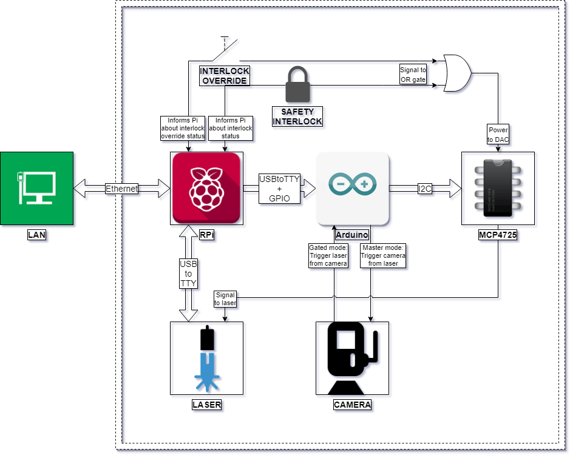
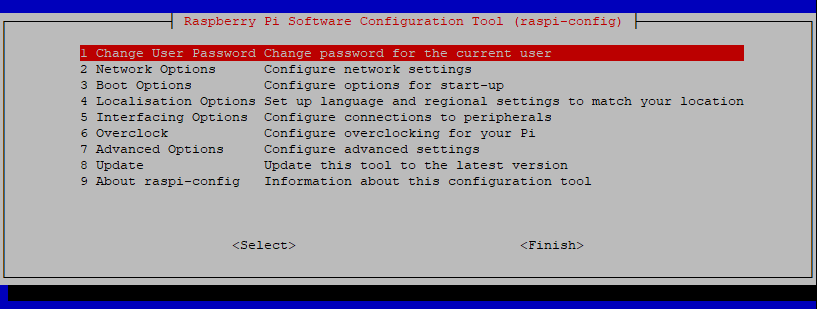
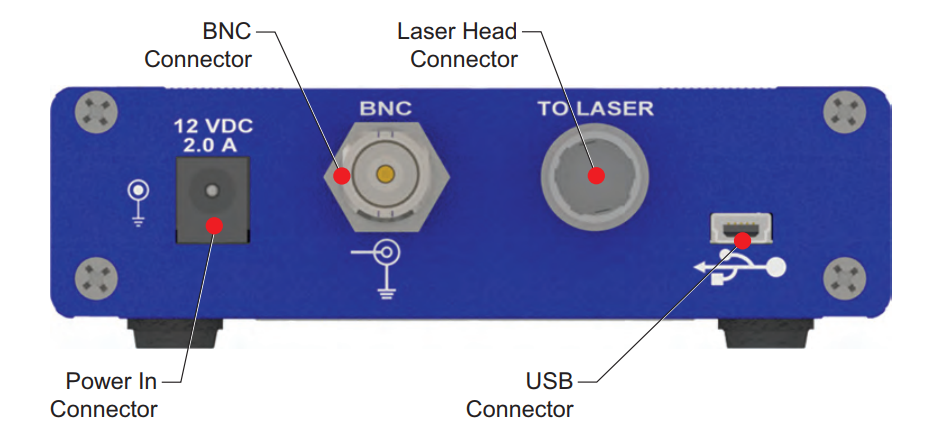
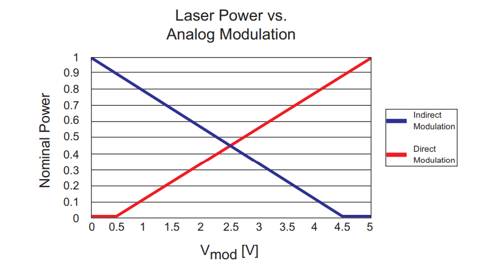
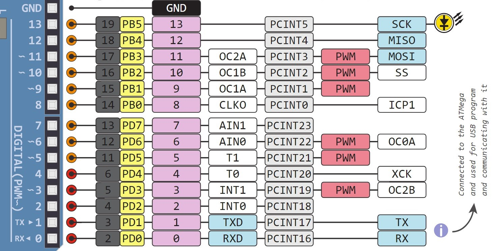
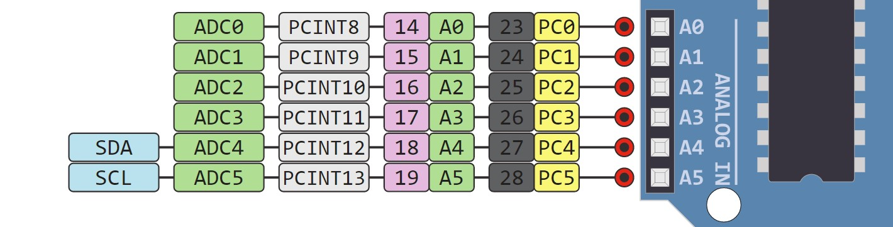
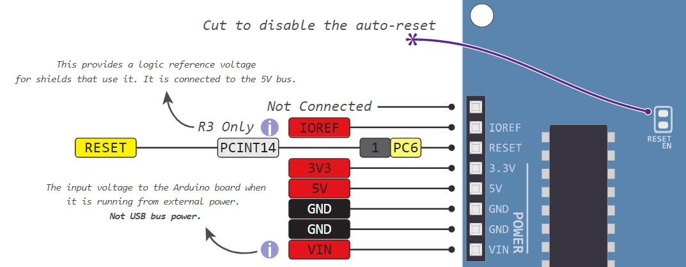

# I14 Remote Laser Controller

Software developed for the remote control and monitoring of a laser at the [Diamond Light Source I14 instrument](https://www.diamond.ac.uk/Instruments/Imaging-and-Microscopy/I14.html).

The following documentation is designed as a guide to simplify the processes of preparing the hardware and installing this software, as well as extending its functionality and applying it to other components or instruments.

## Table of Contents

- [Introduction](#introduction)
  - [Key Features](#key-features)
- [The Hardware](#the-hardware)
  - [Raspberry Pi](#raspberry-pi)
    - [Operating System](#operating-system)
    - [Drivers and Packages](#drivers-and-packages)
    - [Python](#python)
    - [Pin Assignment](#pin-assignment)
  - [Laser](#laser)
  - [Arduino](#arduino)
    - [Pin Assignment](#pin-assignment)
    - [LED Signalling](#led-signalling)
    - [Wiring Diagram](#wiring-diagram)
  - [Digital to Analog Converter](#digital-to-analog-converter)
    - [Safety](#safety)
    - [Laser modulation](#laser-modulation)
  - [Camera](#camera)
- [The Software](#the-software)
  - [Server](#server)
    - [Client](#client)
  - [Parser](#parser)
    - [Table of Recognized Commands](#table-of-recognized-commands)
  - [Error Handler](#error-handler)
    - [Table of Errors and Warnings](#table-of-errors-and-warnings)
  - [Laser Serial Communication Script](#laser-serial-communication-script)
  - [Arduino Controller Script (Python)](#arduino-controller-script-python)
    - [Arduino Controller Script (C for AVR)](#arduino-controller-script-c-for-avr)
- [Licensing](#licensing)
- [Author](#author)
- [Acknowledgements](#acknowledgements)


## Introduction

At the core of this "system" lies a [Raspberry Pi](https://www.raspberrypi.org/), used as a server running a python script which allows it to process text-based commands that it receives over network. A [Coherent Laser](https://www.coherent.com/) is connected to the Raspberry Pi via a USB-to-Serial interface, enabling the Pi to send commands to the laser and monitor its status. An [Arduino board](https://www.arduino.cc/) is also connected to the Raspberry Pi via a USB-to-Serial as well as a GPIO interface, and is mainly responsible for real-time generation of waveforms that are used to modulate the laser via a Digital-to-Analog converter (DAC). Additionally, a camera can also be connected to the Arduino, which can synchronize the camera's shutter with the modulation of the laser.

A diagram that illustrates this setup can be seen below. It was created using [draw.io](https://www.draw.io/), and the source can be downloaded [here](./resources/flowcharts/project_map.xml).




### Key Features

The most noteworthy and desirable features of this project can be summarized as follows:

  - Remote control of laser over LAN
  - Remote monitoring of laser and safety interlock status over LAN
  - High-precision control of laser output intensity
  - Modulation of laser beam with pre-set waveforms of customizable period length and inter-cycle delay:
    - Sine wave, triangle wave, sawtooth wave: cycle period between 1 millisecond and 1 second
    - Square wave, pulse wave: cycle period between 1 millisecond and 1 hour
  - Synchronization of laser with connected camera:
    - "gated mode": laser is turned on only when camera is exposing
    - "master mode": camera exposure triggered when laser intensity reaches a customizable threshold
  - Robust and extensible error handling
  - Modular, well-documented code for easy customization


## The Hardware

The following section documents the steps required to correctly set up the hardware. It describes the setup of the operating system on the Raspberry Pi, as well as the required wiring between the Raspberry Pi, Arduino, DAC, laser and camera.

### Raspberry Pi

The Raspberry Pi used in this project is the [Raspberry Pi 3 B+](https://www.raspberrypi.org/products/raspberry-pi-3-model-b-plus/) (upgraded from the Raspberry Pi B Rev 2.0 on which development took place), chosen due to the following features:
  - 1.4GHz processor (upgraded from 700Mhz)
  - 1GB SDRAM (upgraded from 512MB)
  - 40 GPIO pins (upgraded from 26)
  - Gigabit Ethernet
  - MicroSD port
  - PoE support

According to our specification, the Raspberry Pi needs to be set up so that it can do the following:
  - run a headless Linux OS
  - securely connect to a LAN
  - communicate with other devices on the LAN via SSH
  - communicate with laser via Serial-over-USB
  - communicate with Arduino via Serial-over-USB and GPIO
  - start Python server at boot and ensure it restarts on exit


#### Operating System

The operating system chosen for this project was [Raspbian Stretch Lite](https://www.raspberrypi.org/downloads/raspbian/), an OS based on Debian Stretch with no desktop interface, chosen for its minimal footprint and high compatibility with Raspberry Pi. The required image was downloaded from the [official mirror](https://downloads.raspberrypi.org/raspbian_lite_latest), and written to a 16GB microSD card according to the [installation instructions](https://www.raspberrypi.org/documentation/installation/installing-images/README.md).

As the Pi is being used a server, it needs to be set up to run headless. This process is described in detail [here](https://www.raspberrypi.org/documentation/configuration/wireless/headless.md), but the most important step (activating SSH), can be accomplished by mounting the boot partition of the SD card on any device and creating an empty file with the filename `ssh`. The contents of this file does not matter, as it will be deleted on boot, and SSH should be activated. Alternatively, it is possible to do the initial setup with an attached monitor and keyboard. Note that, on some networks, the MAC address of the Raspberry Pi will first need to be registered before any network communication can take place. In this scenario, using a monitor and keyboard initially is the easiest option.

Once it is possible to interface with the Raspberry Pi, either over SSH or physically, the Raspberry Pi configuration tool will need to be launched using:

```shell
sudo raspi-config
```

You will be presented with a terminal user interface (TUI) similar to the one below:



The settings that will need be changed are:
  - **Change User Password**: change the user password so that it is not possible to start an SSH session with the Raspberry Pi using the default password
  - **Network Options**:
    - **Hostname**: change the name that the Raspberry Pi identifies itself as on the network (default is `raspberrypi`)
  - **Interfacing Options** (optional):
    - **Camera**: disable the CSI camera interface as we are not using it
    - **SSH**: enable the SSH interface if you have not done so already
    - **VNC**: disable the VNC as we are not running a desktop environment
    - **SPI**: disable the SPI interface and automatic loading of the SPI kernel module as we are not using it
    - **I2C**: disable the I2C interface and automatic loading of the I2C kernel module as we are not using it
    - **1-Wire** : disable the 1-Wire interface as we are not using it

If the device will only communicate over Ethernet, then we can disable Wi-Fi and Bluetooth by adding the following lines to `/boot/config.txt`:

```shell
dtoverlay=pi3-disable-wifi
dtoverlay=pi3-disable-bt
```

Once Bluetooth has been disabled, `systemd` will encounter an error when loading the `hciuart` service. Although this error is harmless, in order to avoid the error message at boot, you can do:

```shell
sudo systemctl disable hciuart
```

Optionally, it is a good idea to disable all other services that we will not need. A full list of active `systemd` services is obtained by running `sudo systemctl list-unit-files | grep enabled`. Please inspect this list **carefully** before disabling all but the services you require. I have found that the following services are critical for normal operation of a minimal Raspberry Pi system:

- `autovt`: configures and manages virtual terminals
- `cron`: time-based job scheduler
- `dbus`: inter-process communication and message bus system
- `dhcpcd`: provides a DHCP service
- `fake-hwclock`: emulates a hardware clock on systems that don't have or support one
- `getty`: short for "get TTY", it manages physical or virtual terminals
- `networking`: manages all networking interfaces
- `rsyslog`: manages system logging
- `ssh`: SSH service
- `systemd`: system and service manager for Linux

To disable all enabled services except those listed above, execute:

```shell
sudo systemctl list-unit-files \
  | grep enabled \
  | cut -f 1 -d ' ' \
  | grep -v -E 'autovt|cron|dbus|dhcpcd|fake-hwclock|getty|networking|rsyslog|ssh|systemd' \
  | while read -r line; do sudo systemctl disable $line; done
```

To install an NTP client on the Raspberry Pi:

```shell
sudo apt-get update && sudo apt-get install ntp
```

If the Raspberry Pi is connected to a network without access to an NTP server, or you want to set the time before connecting to a network, you can do so with the following command:

```shell
sudo date -s "DD MMM YYYY HH:MM:SS"
```

##### Firewall setup

Firewall rules for the Raspberry Pi also need to be set up. Firstly, the default behaviour should be that the Pi will drop all incoming and forwarded packets, but allow all outgoing packets:

```shell
iptables -P INPUT DROP
iptables -P FORWARD DROP
iptables -P OUTPUT ACCEPT
```

Secondly, we should enable all communication on the `loopback` interface:

```shell
iptables -A INPUT -i lo -j ACCEPT
iptables -A OUTPUT -o lo -j ACCEPT
```

Additionally, we should allow all established sessions to communicate freely on the network:

```shell
iptables -A INPUT -m conntrack --ctstate ESTABLISHED,RELATED -j ACCEPT
```

Finally, we add exceptions to the default behaviour by allowing the following incoming packets:

```shell
iptables -A INPUT -p tcp --dport 22 -j ACCEPT       # SSH
iptables -A INPUT -p tcp --dport 14000 -j ACCEPT    # Python server
iptables -A INPUT -p udp --dport 123 -j ACCEPT      # NTP
iptables -A INPUT -p udp --dport 67:68 -j ACCEPT    # DHCP
```

##### Default user setup

It may be useful to also change the name and home directory of the default user from the default `pi`. To do this, first log in as the user `pi` and enable the `root` account by changing its password using `sudo passwd root` and entering a new password. Then, reboot the Raspberry Pi and log in as `root`, then execute:

```shell
usermod -l pi new_username
usermod -m -d pi new_username
```

Note that, these two commands cannot be carried out the same time according to the [documentation](https://linux.die.net/man/8/usermod), as changing the login name and the user's home directory have to be carried separately.

After that is done, reboot the system and log in to your new user account. From that account, you can again disable the `root` account by doing the following:

```shell
sudo su -c "usermod -L -e 1 root"
```

#### Drivers and Packages

This section highlights the packages and drivers that need to be installed or set up, either as dependencies by the server, or optional add-ons for easier development and set-up.

##### Flashing '.hex' files to Arduino

As of Arduino 1.6, it is possible to develop Arduino applications directly on the Raspberry Pi, although this is not recommended, as the newly released Arduino CLI has too many dependencies (up to 1GB, including a desktop environment, which is not necessary on a headless Raspberry Pi) for a system with limited storage and memory. Instead, it is recommended that all Arduino development is carried out elsewhere, and the compiled `.hex` can be sent to the Raspberry Pi via `scp`, then flashed onto the Arduino from the Raspberry Pi using `avrdude`.

`avrdude` is a software for programming Atmel AVR controllers, such as the ATmega328 that is at the core of the Arduino Duo. At the time of writing, `avrdude` was available for download using `apt-get`:

```shell
sudo apt-get install avrdude
```

Alternatively, you can download the latest source code from [here](http://download.savannah.gnu.org/releases/avrdude/), and compile from source.

Flashing a `.hex` file can then be accomplished by running the following command, explained below:

```shell
sudo avrdude -p atmega328p -P /dev/ttyACM0 -c arduino -U flash:w:arduino.hex:i
```

- `sudo` to give `avrdude` permission to access the USB device
- `-p atmega328p` to select the part number of the microcontroller (atmega328p for my Arduino Uno)
- `-P /dev/ttyACM0` to specify the communication port (change this if your Arduino is assigned a different port)
- `-c arduino` to specify the programmer type (`arduino` is the safest option, but a different setting may be needed depending on your chip)
- `-U flash:w:arduino.hex:i` is the command that does the actual programming
  - `flash` is the memory type we are flashing
  - `w` specifies write mode (which usually also carries out a verify pass after flashing)
  - `arduino.hex` is the filename of the `.hex` file we are flashing (change this to your filename)
  - `i` specifies that this file has the “Intel Hex” format

Many other options are also available, that may or not may be useful or necessary when doing your own development. A nice tutorial that highlights all the important options can be found [here](http://www.ladyada.net/learn/avr/avrdude.html).

##### Setting up USB laser as a Serial device

When the laser is first plugged in to the Arduino, it is not recognised as a device capable of serial input/output. Although the laser uses a standard FTDI chip, its VID/PID is not one recognised by Linux as a `ftdi_sio` device. Luckily, most modern Linux distributions (including Raspbian) have FTDI drivers built into their Kernel.

We start by creating a shell script `laserUSBtoSerial.sh` (alternatively, you can download it from [here](./laserUSBtoSerial.sh)):

```shell
#!/bin/bash
modprobe ftdi_sio
echo 0d4d 003d > /sys/bus/usb-serial/drivers/ftdi_sio/new_id
udevadm control --reload && udevadm trigger
```

`modprobe` adds an `ftdi_sio` module into the Linux kernel. Using `echo`, we then insert the Vendor ID (`0d4d` - registered by Coherent) and the Product ID (`003d` - specific to this laser model) into a file newly created by `modprobe`. This allows the kernel to associate a device that identifies itself using that VID/PID combination (our laser) with the relevant FTDI driver. Finally, for a change to be detected by the kernel, the USB device needs to unplugged (if it is plugged in), and re-plugged. If physical access to the device is not available as expected, `udevadm` is used to reload the udev rules and trigger a USB plug-in event.

This script needs to be executed with superuser privileges after every reboot:

```shell
sudo su -c "./laserUSBtoSerial.sh"
```

In order to avoid having to manually run the script, it is recommended to install it a `systemd` service that will run this script once at boot.

We will create a `.service` file in the path `/lib/systemd/system/` called `laserUSBtoSerial.service` as follows (or download it from [here](./laserUSBtoSerial.service)):

```shell
[Unit]
Description=Enable Coherent Laser USB-to-Serial

[Service]
Type=forking
ExecStart=/home/pi/laserUSBtoSerial.sh

[Install]
WantedBy=multi-user.target
```

For the sake of brevity, the options specified in this `systemd.service` file will not be explained here. Instead, a page that gives in-depth explanations and usage examples of all the available options can be viewed [here](https://www.freedesktop.org/software/systemd/man/systemd.service.html).

Once the file is created, its permission will need to be changed to allow execution:

```shell
sudo chmod 744 laserUSBtoSerial.sh
```

Finally, the `.service` will need to be enabled:

```shell
sudo systemctl enable laserUSBtoSerial.service
```

At this point, the service should be set up to execute our script at boot. To test whether the service is configured properly, you can execute `sudo systemctl start laserUSBtoSerial` , or simply reboot the device. Then, check the status of the service using `sudo systemctl status laserUSBtoSerial` (the presence of any errors will be highlighted in red, and point to an incorrect setup of the service).

#### Python

The server for the Raspberry Pi was written in `Python3` and tested on `3.5.3`, which was the version that came preinstalled with operating system. The list of non-trivial libraries that the server and parser depend on are:

- `RPi.GPIO`: for control of GPIO pins
- `serial`: for serial communication with connected devices
- `socket`: needed for accessing the BSD socket interface
- `threading`: needed for a threaded server

Out of these, `RPi.GPIO` and `serial` are not included in Python's Standard Library (`RPi.GPIO`, however, comes preinstalled for `Python2` with Raspberry Pi). These libraries will need to be installed manually:

```shell
sudo apt-get install python3-rpi.gpio
sudo apt-get install python3-serial
```

#### Pin Assignment

The pinout of the Raspberry Pi can be seen in the image below (obtained from [pinout.xyz](https://pinout.xyz/resources/raspberry-pi-pinout.png)):


A large number of the GPIO pins available to us are, or can be, used for other purposes, such as I2C, SPI, and UART. The pins assigned in this project have been carefully selected to not overlap with any of these interfaces, not because they are being used in this project, but because in the scenario where their use becomes useful, the pins will not need to be moved and the code will not need to be edited. The following table describes the pin assignment used for the Raspberry Pi.

| GPIO (BCM) Pin Number | Physical Pin Number |         Assignment        | Input / Output |                                                             Description                                                             |
|:---------------------:|:-------------------:|:-------------------------:|:--------------:|:-----------------------------------------------------------------------------------------------------------------------------------:|
|           0           |          27         |         UNASSIGNED        |                |                                                     Used by Raspberry Pi for I2C                                                    |
|           1           |          28         |         UNASSIGNED        |                |                                                     Used by Raspberry Pi for I2C                                                    |
|           2           |          3          |         UNASSIGNED        |                |                                                     Used by Raspberry Pi for I2C                                                    |
|           3           |          5          |         UNASSIGNED        |                |                                                     Used by Raspberry Pi for I2C                                                    |
|           4           |          7          |         UNASSIGNED        |                |         Used by Raspberry Pi for GPCLK, allows the Pi to be set up to output a fixed frequency without any software control         |
|           5           |          29         |         UNASSIGNED        |                |         Used by Raspberry Pi for GPCLK, allows the Pi to be set up to output a fixed frequency without any software control         |
|           6           |          31         |         UNASSIGNED        |                |         Used by Raspberry Pi for GPCLK, allows the Pi to be set up to output a fixed frequency without any software control         |
|           7           |          26         |         UNASSIGNED        |                |                                                   Used by the Raspberry Pi for SPI                                                  |
|           8           |          24         |         UNASSIGNED        |                |                                                   Used by the Raspberry Pi for SPI                                                  |
|           9           |          21         |         UNASSIGNED        |                |                                                   Used by the Raspberry Pi for SPI                                                  |
|           10          |          19         |         UNASSIGNED        |                |                                                   Used by the Raspberry Pi for SPI                                                  |
|           11          |          23         |         UNASSIGNED        |                |                                                   Used by the Raspberry Pi for SPI                                                  |
|           12          |          32         |         UNASSIGNED        |                |                                              Used by the Raspberry Pi for Hardware PWM                                              |
|           13          |          3          |         UNASSIGNED        |                |                                              Used by the Raspberry Pi for Hardware PWM                                              |
|           14          |          8          |         UNASSIGNED        |                |                                                  Used by the Raspberry Pi for UART                                                  |
|           15          |          10         |         UNASSIGNED        |                |                                                  Used by the Raspberry Pi for UART                                                  |
|           16          |          36         |  SAFETY INTERLOCK STATUS  |     OUTPUT     |     A combination of 2 of the Operation Mode Selector pins will signal the Arduino to switch to the corresponding operation mode    |
|           17          |          11         |  MODULATION MODE SELECTOR |     OUTPUT     | A combination of 3 Modulation Mode Selector pins will signal the Arduino to output one of the corresponding preprogrammed waveforms |
|           18          |          12         |         UNASSIGNED        |                |                                                  Used by the Raspberry Pi for UART                                                  |
|           19          |          35         |         UNASSIGNED        |                |                                                   Used by the Raspberry Pi for SPI                                                  |
|           20          |          38         |         UNASSIGNED        |                |                                                   Used by the Raspberry Pi for SPI                                                  |
|           21          |          40         |         UNASSIGNED        |                |                                                   Used by the Raspberry Pi for SPI                                                  |
|           22          |          15         |  MODULATION MODE SELECTOR |     OUTPUT     | A combination of 3 Modulation Mode Selector pins will signal the Arduino to output one of the corresponding preprogrammed waveforms |
|           23          |          16         |  OPERATION MODE SELECTOR  |      INPUT     |                                             Monitors the status of the safety interlock                                             |
|           24          |          18         |  OPERATION MODE SELECTOR  |      INPUT     |                                         Monitors the status of the safety interlock override                                        |
|           25          |          22         |       ARDUINO RESET       |     OUTPUT     |                           Turning on this pin will reset the Arduino and bring back to a known safe state                           |
|           26          |          37         | INTERLOCK OVERRIDE STATUS |     OUTPUT     |     A combination of 2 of the Operation Mode Selector pins will signal the Arduino to switch to the corresponding operation mode    |
|           27          |          13         |  MODULATION MODE SELECTOR |     OUTPUT     | A combination of 3 Modulation Mode Selector pins will signal the Arduino to output one of the corresponding preprogrammed waveforms |

### Laser

The laser used in this project is the [Coherent BioRay](https://www.coherent.com/lasers/laser/stingray-and-bioray-lasers) laser, controlled by a corresponding Coherent BioRay Controller unit, as specified in the [documentation](https://edge.coherent.com/assets/pdf/Coherent-BioRay-Operator-s-Manual.pdf).

The back panel of the controller unit has the following connectors (alternatively, see Figure 4-2. in the documentation):



The controller unit receives power via the *Power In Connector*, and in turns supplies power to the laser via the *Laser Head Connector* into which the laser itself is connected. The *BNC connector* allows signals and waveforms to be sent to the laser controller, which will modulate the laser according to the following diagram (alternatively, Figure 2-1 in the documentation):



The *Mini USB B* connector allows commands to be sent to the laser via RS-232 over USB. The laser supports many different commands for changing the settings or getting the status of the laser (full list can be seen as Table 5-1. in the documentation), most of which will not be used in this project. The Raspberry Pi communicates directly with the laser by sending and receiving serial data via a USB A to Mini USB B cable connected to the controller.

### Arduino

The Arduino used in this project is the [Arduino Uno](https://store.arduino.cc/arduino-uno-rev3), used as a smart modulation controller for the laser described above. This specific Arduino was chosen due to its small size as well as the following features:

- 5V operating voltage (same as the Raspberry Pi)
- 14 digital I/O pins (6 are hardware PWM output pins)
- 6 analog input pins
- 32KB of Flash Memory
- 2KB of SRAM
- 16MHz clock speed

According to our specification, the Arduino will need to be setup up to be able to do the following:

- receive Serial messages from the Raspberry Pi
- read GPIO pins to determine the modulation mode and operation mode
- send I2C data to a connected DAC
- generate waveforms of different shape, amplitude and frequency
  - allow all waveforms to trigger camera at a user-defined threshold
  - allow some waveforms to be triggered by a camera
- signal status using LED and piezo buzzer
- detect (hardware and software) the breaking of the safety interlock
- visually and audibly warn when overriding the safety interlock

#### Pin Assignment

This section will describe what every pin on the Arduino will be set up to do, as well as how the Arduino will be wired with other components. A very nice diagram of the full Arduino pinout can be seen on [circuito.io](https://www.circuito.io/blog/arduino-uno-pinout/), from which I have taken snippets and included below.

The Arduino has 14 digital IO pins, marked as 0 to 13 in purple on the diagram below:



The assignment of these digital pins is summarized as follows:

| Pin Number |        Assignment       | Input/Output/PWM |                              Description                              |
|:----------:|:------------------------:|:----------------:|:---------------------------------------------------------------------:|
|      0     |        UNASSIGNED        |                  |              Used by the Arduino for serial communication             |
|      1     |        UNASSIGNED        |                  |              Used by the Arduino for serial communication             |
|      2     |       LASER TRIGGER      |       INPUT      |     Enables connected camera to trigger laser pulses when exposing    |
|      3     |      CAMERA TRIGGER      |      OUTPUT      | Enables laser to synchronise camera shutter with a generated waveform |
|      4     | MODULATION MODE SELECTOR |       INPUT      |          Activates one of the preprogramed modulation modes          |
|      5     |         POWER LED        |        PWM       |                 Controls intensity of green power LED                 |
|      6     |          BUZZER          |        PWM       |                        Controls tone of buzzer                        |
|      7     | MODULATION MODE SELECTOR |       INPUT      |          Activates one of the preprogramed modulation modes          |
|      8     | MODULATION MODE SELECTOR |       INPUT      |          Activates one of the preprogramed modulation modes          |
|      9     |         [R]GB LED        |        PWM       |              Controls intensity of red colour in RGB LED              |
|     10     |         RG[B] LED        |        PWM       |              Controls intensity of blue colour in RGB LED             |
|     11     |         R[G]B LED        |        PWM       |             Controls intensity of green colour in RGB LED             |
|     12     |        UNASSIGNED        |                  |                                 Unused                                |
|     13     |        UNASSIGNED        |                  |                          Used by built-in LED                         |

The Arduino also has 6 analog input pins, marked as A0 to A5 in green on the diagram below:



The assignment of the analog pins is summarised by the following table:

| Pin Number |       Assignment       |                      Description                     |
|:----------:|:-----------------------:|:----------------------------------------------------:|
|     A0     | OPERATION MODE SELECTOR |   Activates one of the preprogramed operation modes  |
|     A1     | OPERATION MODE SELECTOR |   Activates one of the preprogramed operation modes  |
|     A2     |    INTERLOCK MONITOR    |      Monitors the status of the safety interlock     |
|     A3     |     OVERRIDE MONITOR    | Monitors the status of the safety interlock override |
|     A4     |        UNASSIGNED       |         Used by Arduino for I2C communication        |
|     A5     |        UNASSIGNED       |         Used by Arduino for I2C communication        |

It is important to note that:
- For any digital pin, the Arduino defines voltages below 0.8V as LOW and voltages above 2V as HIGH. If any digital input pin has a voltage between 0.8V and 2V, its state is "undefined". That is why it is important to use **pull-down resistors** (or pull-up resistors, but none have been used in this project), to make sure the pin is pulled down below 0.8V when no voltage is applied, so the pin can be read as LOW. The pull-down resistors used in the project are all 2.2 kohm.
- The recommended maximum current that a single pin can take/provide is 20mA.
- The absolute maximum current that all pins can take/provide together is 200mA.

##### Resetting Arduino

It will sometimes be necessary to bring the Arduino back to a "known safe state", for example after a power loss of the Raspberry Pi, the internal variables of the server will need to be reinitialised and match those on the Arduino. We do this by connecting the "RESET" pin on the Arduino (see image below) to an NPN Transistor (for example, [this one](https://www.sparkfun.com/datasheets/Components/BC546.pdf)). The *collector* of the transistor would connect to the RESET pin, while the *emitter* would be connected to ground. The *base* of the transistor will be set up to connect to a pin on the Raspberry Pi, which can then trigger the reset of the Arduino.



It is important to note that, when the transistor is *saturated* (see [here](https://learn.sparkfun.com/tutorials/transistors/operation-modes)), it is essentially acting like a short-circuit and therefore damaging the transistor as well as the GPIO pin on the Raspberry Pi. Therefore, an appropriate resistor needs to be wired between the transistor *base* and the GPIO pin (I have used the same resistor as those used for pull-down).

#### LED Signalling

A green "power" LED as well as an RGB "status" LED is used to signal different events or states that the Arduino is in. The list of all possible colour combinations, as well as their meaning, can be seen in this table:

|           Status           | Power LED (green) |   Status LED (RGB)   |                         Description                          |
| :------------------------: | :---------------: | :------------------: | :----------------------------------------------------------: |
|         Power off          |        Off        |         Off          |   The device is not receiving power or is being programmed   |
|          Booting           |       Green       |      RGB cycle       |           The device is in the process of booting            |
|           Ready            |       Green       |         Off          |   The device is ready and waiting to receive instructions    |
|      Lasing (normal)       |       Green       |  Blue (continuous)   | The device is device is modulating the laser with a non-zero amplitude continuous wave, sine wave, triangle wave or sawtooth wave |
|      Lasing (pulsed)       |       Green       |  Blue (intermittent)  | The device is modulating the laser with a square wave or a pulse train, where the RGB LED will be illuminated synchronously with the laser |
|        Calibrating         |       Green       | Magenta (continuous) | The device is undergoing a calibration pass after it has received new wave parameters. |
|       Receiving data       |       Green       |  Green (continuous)  | The device is receiving or parsing data received from an attached serial device |
|   Safety Interlock Open    |       Green       |   Red (continuous)    | The device detected that the safety interlock is open and is not being manually overridden, therefore laser modulation has been temporarily disabled. |
| Safety Interlock Overridden |       Green       | Orange (intermittent) | The device detected that the safety interlock is open but it is being manually override. Laser modulation is enabled but an audible warning will sound (if enabled) synchronously with the orange warning light. |

#### Wiring Diagram

Paste diagram and pictures. Expain diagram. Probably split it into sections

!!!!!!!!!!!!!!!!!!!!!!!!!!!!!!!!!!!!!!!!!!!!!!!!!!!!!!!!!!!!!!!!!!!!!!!!!!!!!!!!!!!!!!!!!!!!!!!!!!!!!!!!!!!!!!!!!!!!!!!!!!!!!!!!!!!!!!!!!!!!!!!!!!!!!!!!!!!!!!!!!!!!!!!!!!!!!!!!!!!!!!!!!!!!!!!!!!!!!!!!!!!!!!!!!!!!!!!!!!!!!!!!!!!!!!!!!!!!!!!!!!!!!!!!!!!!!!!!!!!!!!!!!!!!!!!!!!!!!!!!!!!!!!!!!!!!!!!!!!!!!!!!!!!!!!!!!!!!!!!!!!!!!!!!!!!!!!!!!!!!!!!!!!!!!!!!!!!!!!!!!!!!!!!!!!!!!!!!!!!!!!!!!!!!!!!!!!!!!!!!!!!!!!!!!!!!!!!!!!!!!!!!!!!!!!!!!!!!!!!!!!!!!!!!!!!!!!!!

### Digital to Analog Converter

The digital-to-analog converter (DAC) used in the project is the 12-bit [MCP4725](https://cdn-shop.adafruit.com/datasheets/mcp4725.pdf) on an [Adafruit breakout board](https://www.adafruit.com/product/935). A useful tutorial by Adafruit on how to use the DAC with both Arduino and Raspberry Pi can be found [here](https://learn.adafruit.com/mcp4725-12-bit-dac-tutorial).

The DAC receives data from the Ardino using the I2C interface, where the DAC is the slave device and Arduino is the master. The DAC's `SCL` and `SDA` pins connect directly to Arduino's `SCL [A5]` and `SDA [A4]` pins. The DAC receives 5V through its `VDD` pin, and can output any voltage between 0V and 5V with a 12-bit accuracy through its `VOUT` pin.

#### Safety

Instead of the DAC being connected directly to Arduino's 5V output, it is powered through a logical OR gate (see [datasheet](http://www.ti.com/lit/ds/symlink/cd54hc32.pdf)) which takes two inputs: safety interlock, and interlock override. If the safety interlock is open (safety interlock line goes LOW), and the interlock override is not switched on (override line is also LOW), the gate will switch off the 5V output. As the DAC loses power, it can no longer output any signal, thereby modulating the laser beam to zero.

Additionally, once the DAC's power returns (either the interlock is closed or the override is turned on), the DAC's EEPROM has been set up so that it resumes to a safe state (output of 0V). The DAC will therefore have to be explicitly told to restart modulating the laser.

#### Laser Modulation

The Arduino has been programmed with 6 different modulation modes. If modulation is set to `none`, a waveform will not be generated, but a continuous wave of adjustable amplitude will be outputted. At an amplitude of 100%, the laser output looks like the image below, and looks analogous to how it operated before this project.


The amplitude of the continuous wave can be set to any value between 0% and 100%. Here is the oscilloscope output for a continuous wave, this time at 42% amplitude.


The second modulation mode is `sine`. This mode generates a sine wave with a custom amplitude and period. The image below shows a sine wave at 100% amplitude with a period of exactly 100 milliseconds.


The amplitude of any wave can be changed. For the sake of brevity, not every waveform will be included with a range of amplitudes in this documentation. The following image is also a 100 millisecond sine wave, but this time with an amplitude of about 42%


An additional parameter can be specified for any wave: the delay between every successive cycle. The wave below is a 100ms period wave with a delay of 200ms between waves, creating a total period of exactly 300ms.


If the operation mode of the Arduino is set to `master`, then the Arduino will output a HIGH when the amplitude of a wave reaches a user-defined threshold. This output, shown in blue, can be used to synchronise the laser modulation with the shutter of a camera (for example, only exposing when the laser is illuminating the sample adequately).


The previous image showed the trigger threshold at 50%. The following image shows the behaviour when the threshold is raised to 80%


The period of the sine wave can be as high as 1 second. The image below shows this wave being generated fairly accurately, only 1.1% above the target period. Periods higher than 1 second are disabled, as above this value, you should consider switching to continuous-wave mode.


The period of the sine wave can also pushed a lot lower than 100ms, but with some disadvantages. The image below shows a sine wave with a target period of 10ms, with a true value of 0.9% above the target. The wave is no longer smooth, and the time it takes for the DAC to update the voltage and the Arduino to calculate the next point on the wave becomes visible.


When this period is pushed even lower, the generated wave looks less like a sine wave and instead resembles a triangle wave. The target period of this wave is 2ms, but it is being generated with a period 16.7% higher than the target - a value no longer considered acceptably accurate.


At the smallest possible period, the wave is no longer a sine wave. The square wave generated below is a sine wave with a target period of 1ms. The actual period is also 32.7% larger than the target. Due to this increase in inaccuracies with decreasing period targets, periods under 10ms are considered "inaccurate", and should only be used if higher frequencies are necessary (but using `square` as your modulation mode would give even higher frequencies with much higher accuracy).


The same behaviour can be seen across other waveforms as well. The images below are for the `triangle` and `sawtooth` modulation modes.

|  |  |
|:-:|:-:|
| Triangle wave at 100ms target (exact) | Triangle wave at 1ms target (+7.9%) |

|  |  |
|:-:|:-:|
| Sawtooth wave at (1s) 1000ms target (+0.4%) | Sawtooth wave at 1ms target (+41.2%) |

The final modulation mode available is `pulse`. A single pulse is defined by three parameters: the amplitude of the pulse, the length of the pulse, and the delay until the start of the successive pulse. This mode allows for pulses of length up to 1 hour, and as little as a millisecond. The following image shows a 100 millisecond pulse followed by a second pause, resulting in a perfect 1.1 second period.


The following data gives the exact limits applied to the selection of the period for various modulation modes, and their measured corresponding deviations from the expected value:

| Modulation Mode | Period Limits | Needs calibration | Calibration Length | Typical [maximum] deviation (10ms - 100ms) | Typical [maximum] deviation (< 10ms) |
|:---------------:|:-------------:|:-----------------:|:------------------:|:------------------------------------------:|:------------------------------------:|
|      `none`     |      none     |         No        |         N/A        |                     N/A                    |                  N/A                 |
|      `sine`     |    1ms - 1s   |        Yes        |      5s - 10s      |                  +1% [+2%]                 |              +20% [+50%]             |
|     `square`    |   1ms - 1hr   |         No        |         N/A        |                 +0.5% [+1%]                |              +5% [+10%]              |
|    `triangle`   |    1ms - 1s   |        Yes        |      5s - 10s      |                  +1% [+2%]                 |              +20% [+50%]             |
|    `sawtooth`   |    1ms - 1s   |        Yes        |      5s - 10s      |                  +1% [+2%]                 |              +20% [+50%]             |
|     `pulse`     |   1ms - 1hr   |         No        |         N/A        |                 +0.5% [+1%]                |              +5% [+10%]              |

### Camera

The camera used in this project is the [Alled Vison Manta](https://www.alliedvision.com/fileadmin/content/documents/products/cameras/Manta/techman/Manta_TechMan.pdf
). It uses the Hirose HR10-10R-12PA(73) connector, for which we used the Hirose HR10A-10P-12S breakout cable. The pin numbering for the Hirose cable can be seen below:


According to the input diagram


add pin assignment section, just like I wrote on the paper!


## The Software

### Server


CRATE A FILE FROM THIS AND HOST IT, AND CLEAN IT UP, LIKE ABOVE

'''
[Unit]
Description=Python3 server
After=multi-user.target
Wants = network-online.target
After = network.target network-online.target

[Service]
Type=idle
Restart=always
ExecStart=/usr/bin/python3 /home/pi/server.py

[Install]
WantedBy=multi-user.target
'''

/lib/systemd/system/server.service

#### Client


### Parser

#### Table of Recognized Commands

### Error handler

#### Table of Errors and Warnings

(change to table of return codes?) (change warnings to stackable! 01+02+04 (up to 16?))

| Return Code | Return Code type |                         Description                          | More details given? |
| :---------: | :--------------: | :----------------------------------------------------------: | :-----------------: |
|     00      |     SUCCESS      |   The requested action completed without error or warning    |         No          |
|     01      |     WARNING      | The requested action was not carried out as it would have no effect |         No          |
|             |                  |                                                              |                     |


### Laser Serial Communication Script


### Arduino Controller Script (Python)

nohup

https://raspberrypi.stackexchange.com/questions/9695/disable-dtr-on-ttyusb0/31298#31298

https://linux.die.net/man/1/stty


#### Arduino Controller Script (C for AVR)

At the core of the Arduino Uno lies the Atmel ATmega328p microcontroller.

<MODES OF OPERATION, MODES OF MODULATION>

talk about why I had to replace the Wire library

http://dsscircuits.com/articles/arduino-i2c-master-library

changed compilation parameter to -O2 (talk about it) File --> Preferences --> Follow link at the bottom of page (using arduino 1.8.5)
"%USERPROFILE%\AppData\Local" on Windows, C:\Users\lyv26778\AppData\Local\Arduino15\preferences.txt, change all occurences (3) of -Os to -O2, restart Arduino IDE

## Licensing

## Author

Talk about me quickly, mention contact details, give supervisor details as well

## Acknowledgements

Same as pptx, + Hristo and Jess
